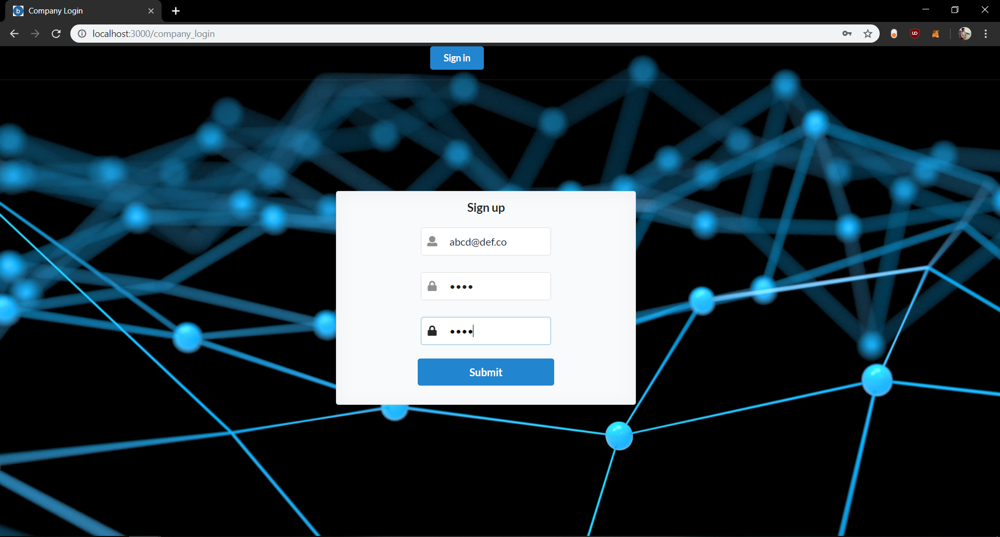
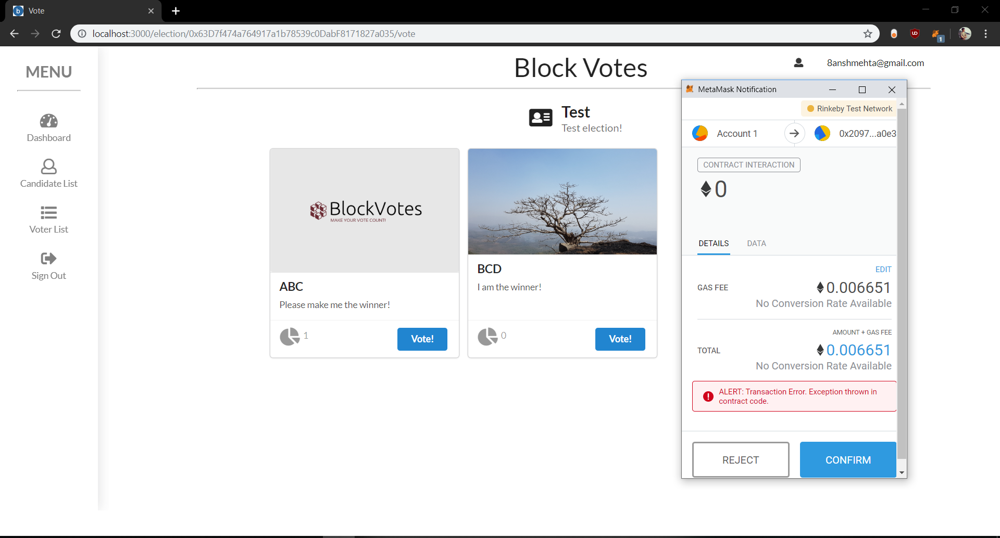

# Makerere Ethereum Blockchain Voting

A decentralized voting system for Makerere University based on Ethereum blockchain technology.

> This is a final year project that has been worked on by Andrew Ssempangi and Wamanga Peter under the supervision
of Dr. Ronald Kizito and Ms. Carol Ovon.
```bash


## System Workflow

A brief explanation on the basic workflow of the application.

- The Admin registers with their email and password which are then stored in a Mongo database. Those details are used to sign in to view the dashboard
- The Admin can then create a voting instance by creating an election and filling in additional information about the election.
- The Admin is also responsible for adding Candidates who are sent emails that contain login in details
- The registered user (voter) following the approval from the admin casts their vote to the candidate of interest (from the voting page).
- After some time, depending on the scale of the election the admin ends the election. As that happens the voting is closed and the results are displayed announcing the winner on the dashboard and also sending out emails to both the candidates and the voters.

---

## Setting up the development environment

### Requirements
Thee following are some of the requirements for running the application on your localhost. Follow the links to download
the requirements.

- [Node.js](https://nodejs.org)
- [Solidity](https://docs.soliditylang.org/en/v0.8.16/)
- [MongoDB](https://www.mongodb.com/) (Database)
- [Metamask](https://metamask.io/) (Browser Extension)

# install dependencies
npm install

# serve with hot reload at localhost:3000
npm start
```

Create your own <b>.env</b> file and the file should contain:
```bash
EMAIL=YOUR_EMAIL_ID
PASSWORD=YOUR_PASSWORD_FOR_EMAIL_ID
```
Install MetaMask extension (https://metamask.io/download.html) and make sure to have some Ether to test the application locally. Ether can be fetched from Rinkeby Faucet (https://faucet.rinkeby.io)

#### Note:
- Make sure to install Node.js v14.17.3 to make sure the app runs fine. Testing for other node versions is yet to be done.
- MongoDB must be working in background on localhost:27017


## Tech Stack:

- Solidity/Web3 (for writing/connecting the Blockchain contract)
- Next.js & Semantic UI React (front-end)
- MongoDB/ExpressJS/Node.js (back-end)
- IPFS (file storage for images)

## Screenshots of the app:

Homepage of the application:


Company registers/logs in:



Company creates an election if not created:


Dashboard on successful election creation:


List of candidates for the election (here, you can add candidates):


Candidate has been notified on the mail:


List of voters for the election (here, you can add voters):


Voters have been sent their secure usernames and passwords on the mail:


Voter login page:


Successful voting scenario:


Unsuccessful voting scenario:



Notification to each candidate and voter for the winner of candidates:


